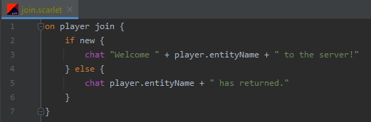

### Scarlet

---


Scarlet is an interpreted programming language built for Minecraft on the Fabric Loader. 
It is designed to allow quick prototyping for server scripting & content creation.

---

**What is Scarlet used for?**

Scarlet makes it easy to add new scripted content to the game without prior Java experience.
My primary target audience is (1) people looking to have fun with friends on private servers, and (2) people who
need a tool for scripting Minecraft video content or minigames (which isn't a strong point of Java).

Scarlet is also a viable option for modpack event scripting, but for anything serious being shipped to production,
I would recommend [KubeJS](https://kubejs.com/) instead.

---

**Give me an example!**

Scarlet code goes in your `/run/scarlet/` directory with the .scarlet file extension. 
Reload all Scarlet code by pressing the 'R' key.
How about we print a simple greeting when a player joins the server?



*Oops! I made a mistake while typing this out and wrote "on join server" instead,* you say, wondering how Scarlet will handle it.
Scarlet has a nice error logging system which will show you exactly where offending code lies:


---

**Give me more examples!**

You can find a collection of Scarlet example scripts in the `/example_scripts/` directory of this repository.
Here are a few of our favorites:

- [File IO](example_scripts/file_io.scarlet)
- [Iteration & Delays](example_scripts/delayed_iteration.scarlet)
- [Java Property Resolving](example_scripts/player_use_item.scarlet)

---

### API for you!

Most of the Minecraft-related language mechanics in Scarlet are powered by an API that is available to everyone.
This system is undocumented for now, but if you are interested in toying around with it, take this example of implementing a custom
expression for killing entities:

```java
public class KillExpression extends ScarletPatternExpression {

    private static final ExpressionFragment TARGET = ExpressionFragment.of();
    private static final ScarletSyntax KILL = new ScarletSyntax(LiteralFragment.of("kill"), TARGET);

    @Override
    public ScarletSyntax getPattern() {
        return KILL;
    }

    @Override
    public Object apply(ScarletSyntax.Instance syntax, ScarletInterpreter interpreter, BlockStatement block) {
        Expression expression = syntax.get(TARGET);
        Object variable = expression.evaluate(interpreter);
        if(variable instanceof Entity entity) {
            entity.kill();
            return true;
        }

        return false;
    }
}
```

```java
ScarletLanguage.registerExpression(new KillExpression());
```

`ScarletLanguage.registerEvent(ScarletPatternExpression)` is also available for registering event syntax (anything that reads "on this event"...).

---

### A Note on Stability

Scarlet is, first and foremost, a fun educational exercise for me in the art of language design. 
I make no promises about the stability of your scripts or API interactions at the current stage of the project,
because the status of the project is based off my personal quest for enjoyment.

My personal gesture regarding stability is that Scarlet will stay in the 0.x.x version scheme while it is unstable
and prone to changes. Once 1.x.x arrives, I will focus on keeping API stable, so you can update without worrying
about me breaking every script you have ever written. :)

---

### Licensing

Scarlet started out as an educational project based off [Crafting Interpreters](https://craftinginterpreters.com/) and other 
compiler resources, which is why it is licensed as MIT. You can read the [LICENSE](LICENSE) file for more information,
but the tl;dr is that you can use the code inside this repository as long as any significant chunks
are accompanied by the license file.