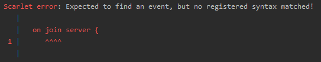

### Scarlet

---


Scarlet is an interpreted programming language built for Minecraft on the Fabric Loader. 
It is designed to allow quick prototyping for server scripting & content creation.

---

**What is Scarlet used for?**

Scarlet makes it easy to add new scripted content to the game without prior Java experience.
My primary target audience is (1) people looking to have fun with friends on private servers, and (2) people who
need a tool for scripting Minecraft video content or minigames (which isn't a strong point of Java).

Scarlet is also a viable option for modpack event scripting, but for anything serious being shipped to production,
I would recommend [KubeJS](https://kubejs.com/) instead.

---

**Give me an example!**

Scarlet code goes in your `/run/scarlet/` directory with the .scarlet file extension. 
Reload all Scarlet code by pressing the 'R' key.
How about we print a simple greeting when a player joins the server?

```scarlet
on player join {
    if new {
        chat "Welcome " + player.entityName + " to the server!"
    } else {
        chat player.entityName + " has returned."
    }
}
```

*Oops! I made a mistake while typing this out and wrote "on join server" instead,* you say, wondering how Scarlet will handle it.
Scarlet has a nice error logging system which will show you exactly where offending code lies:



---

### Licensing

Scarlet started out as an educational project based off [Crafting Interpreters](https://craftinginterpreters.com/) and other 
compiler resources, which is why it is licensed as MIT. You can read the [LICENSE](LICENSE) file for more information,
but the tl;dr is that you can use the code inside this repository as long as any significant chunks
are accompanied by the license file.